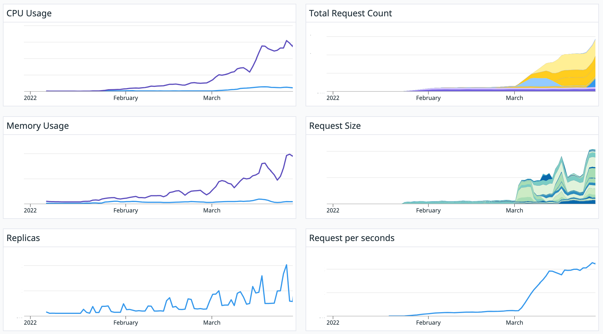

# ニコニコ生放送 WebフロントエンドのKubernetes移行ハンドブック 2022

## はじめに

2021年6月から2022年3月の9ヶ月間でニコニコ生放送のフロントエンドに関係するマイクロサービスをDocker SwarmからKubernetesへ移行しました。
その移行前から移行期間中、移行後にかかる設計や運用方法を実際に実施した事例を元に整理して紹介して行きます。

## 背景

本題に入る前に、移行前のニコニコ生放送のWebフロントエンドチームが管理している「開発からリリース、運用」までのインフラを軽く紹介します。

- jsやcssの静的リソースビルド
- express.jsを搭載したWeb Application Serverの開発（Backend for Frontend）
- Docker Imageのビルド
- 静的リソースのデプロイ
- Apacheやnginx、OpenRestyといったL7ロードバランサーによるトラフィックマネジメント
- Jenkinsを利用したDocker SwarmクラスタのBlue/Greenデプロイ
- ログの送信
- 監視（DataDogなど）

### 移行に主に携わった人たち

Webフロントエンドのチームから主に2人で移行作業を進めていきました。
他のマイクロサービスも別のチームが担当し、知見やリソースの使用状況などを共有しつつ作業を行いました。
背景で紹介したようなインフラの歴史的経緯や、移行後にあるべき状態を整理しつつ、Kubernetesに素早く移行するための方法を設計し実現していきました。

### 移行後のKubernetesの規模感

Kubernetes上でのニコニコ生放送の**フロントエンドに関係するマイクロサービス**のManifestの数は1つのクラスターに対して以下の規模でComponentがあります。

| Component                                  | ファイル数 |
| :----------------------------------------- | ---------: |
| v1/Deployment                              |         22 |
| v1/Service                                 |         60 |
| v1/Config Map                              |         15 |
| batch/v1/Job                               |         14 |
| argoproj.io/v1alpha1/Rollout               |         18 |
| networking.istio.io/v1beta1/VirtualService |         20 |
| networking.istio.io/v1alpha3/EnvoyFilter   |         20 |

※ 規模感と具体的な用途がわかりやすいComponentを記しています。

## 読み方

Backend For Frontendのサーバーを管理する、Webフロントエンドの開発者視点からKubernetes上アプリケーションを稼働させるためのプラクティスを整理しました。
基本的はステートレスなアプリケーションですが、非機能要件にあたる部分が本内容で紹介する主要な部分となります。
ただし、ゼロベースから築かれたプラクティスではなく「移行」という前身のあるアーキテクチャ構成となっており、必ずしも「ベスト」とは言えない構成も存在します。

したがって、Webフロントエンドの開発をしている読者は非機能要件にあたる部分の運用や費用のコスト感覚を意識しつつ、
それらのコストを下げるためにアプリケーションレベルで何ができるか考えるとインフラを触るときに役に立つかもしれません。
逆に普段インフラを触っている読者はWebフロントエンドのインフラを管理するときに考慮する内容の整理として参考になるかもしれません。

